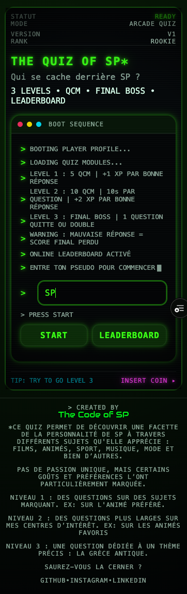
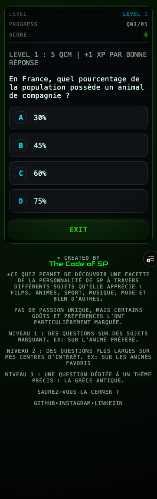
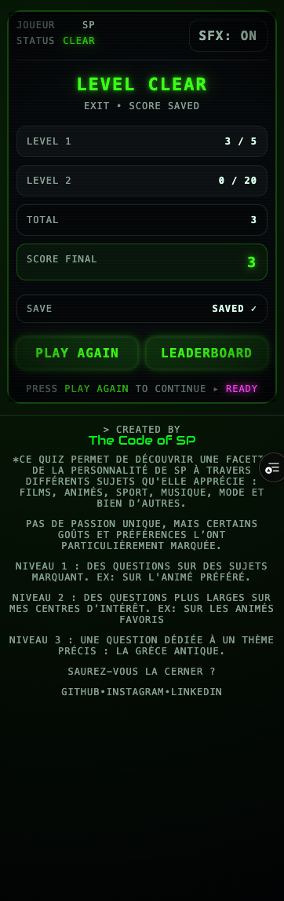
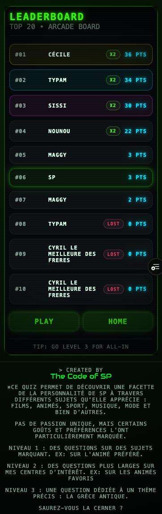

# 🎮 The Quiz of SP

A retro arcade-style full-stack quiz application built with **React**, **SCSS**, **Node.js**, **Express**, and **MongoDB**.

The player progresses through multiple quiz levels, then chooses whether to secure their score or risk everything in a final **Quit or Double** challenge.

Scores are saved to an online leaderboard through a custom REST API.

---

## 🚀 Live Demo

Frontend  
https://thequizofsp.vercel.app

Backend API  
https://thequizofsp-backend.vercel.app

Swagger Docs  
https://thequizofsp-backend.vercel.app/api-docs

---

## ✨ Features

- Multi-level quiz flow
- Timed questions
- Quit or Double final mechanic
- Persistent online leaderboard
- Retro arcade-inspired UI
- Sound effects
- Full-stack deployment with Vercel
- MongoDB Atlas integration

---

## 🧠 Tech Stack

### Frontend

- React
- React Router
- Vite
- SCSS

### Backend

- Node.js
- Express
- MongoDB
- Mongoose
- Swagger

### Deployment

- Vercel
- MongoDB Atlas

---

## 🎮 Game Flow

1. Start page
2. Level 1 quiz
3. Level 2 quiz with timer
4. Transition screen
5. Quit or Double choice
6. Final boss question
7. Result screen
8. Online leaderboard

---

## 📂 Project Structure

```bash
thequizofspv3/
├── backend/
└── frontend/

⚙️ Local Setup
Backend
cd backend
npm install
npm run dev

Frontend
cd frontend
npm install
npm run dev

🔐 Environment Variables

Backend
MONGO_URI=your_mongodb_connection
PORT=5050
BASE_URL=http://localhost:5050
CLIENT_URL=http://localhost:5173

Frontend
VITE_API_URL=http://localhost:5050

🏗️ Architecture Notes
This project was refactored to improve separation of concerns.

Backend

routes define endpoints
controllers handle HTTP layer
services contain business logic
config manages database and Swagger
Frontend
pages orchestrate navigation and flow
components focus on UI logic
services centralize API and quiz session storage
styles are organized with tokens, mixins and page-level SCSS

## Challenges Faced

Some of the main challenges during development were:

- cleaning and restructuring the backend architecture
- separating quiz session logic on the frontend
- handling CORS between local and production environments
- debugging Vercel deployment issues
- connecting MongoDB Atlas in production

📚 What I Learned

Through this project, I improved my skills in:
structuring a full-stack app
separating responsibilities in frontend and backend code
handling localStorage/session flow cleanly
building and documenting a REST API
debugging CORS and deployment issues
deploying a monorepo with Vercel
connecting MongoDB Atlas to a production backend

📌 Future Improvements

Add tests
Add admin moderation for leaderboard entries
Add difficulty modes
Add analytics / game stats
Improve accessibility
Add animations/transitions polish

👤 Author

SP
```

## Screenshots

### Start Screen


### Quiz Level


### Result Screen


### Leaderboard
